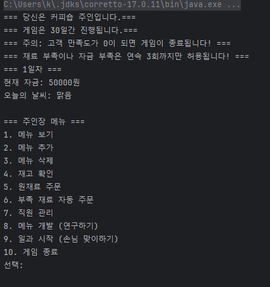
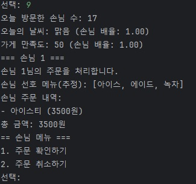
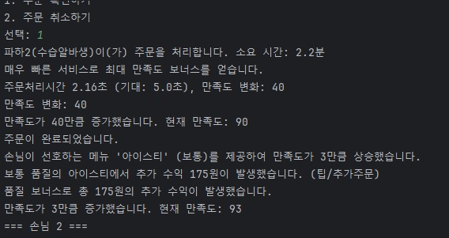
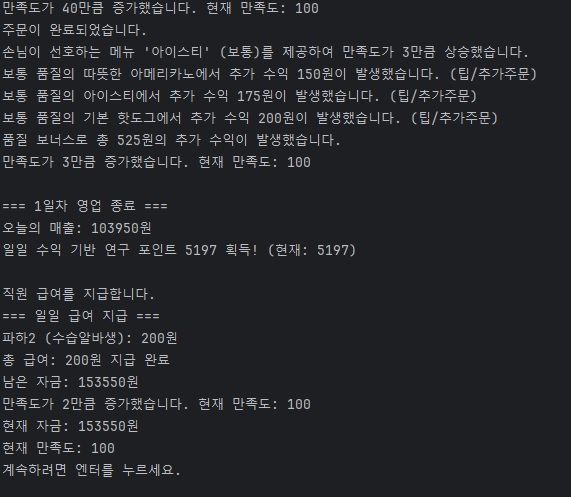

# ☕ CoffeeShop Simulation

A console-based simulation of a coffee shop management system built in Java.  
This project models customer satisfaction, recipe management, weather influence, and research upgrades.

## ✨ Features
- Ingredient and Recipe system
- Customer satisfaction tracking
- Weather effects on customer behavior
- Research system to improve shop performance

## ▶ How to Run
1. Compile all `.java` files
2. Run the main class

## 📁 Files
- `CoffeeShop.java`: Main business logic
- `Customer.java`, `Employee.java`: Actor classes
- `Ingredient.java`, `Recipe.java`: Recipe system
- `Weather.java`: Weather simulation
- `ResearchManager.java`: Upgrade logic

## 📷 Preview

### 🟤 Startup Screen
A simple yet intuitive interface that introduces the player as the café manager, with 30 in-game days to operate the shop.

---

### 🟢 Customer Order Processing
Each customer has unique preferences. Weather and overall satisfaction dynamically influence order frequency and behavior.

---

### 🔵 Real-time Feedback & Bonuses
Fast service, preferred menus, and high-quality ingredients generate bonus satisfaction and tips — simulating real customer response.

---

### 🟣 Daily Summary & Financial Report
End-of-day summaries include total sales, satisfaction changes, employee wages, and research points — offering a business-like cycle.

> This project is more than a simulation — it's a miniature tycoon game built inside the Java console.
>
> By modeling customer behavior, dynamic weather effects, satisfaction-driven demand, and research upgrades,  
> it reflects how real-world business logic can be implemented with object-oriented design and clean logic.

## Author
- GitHub: [kul321](https://github.com/kul321)
