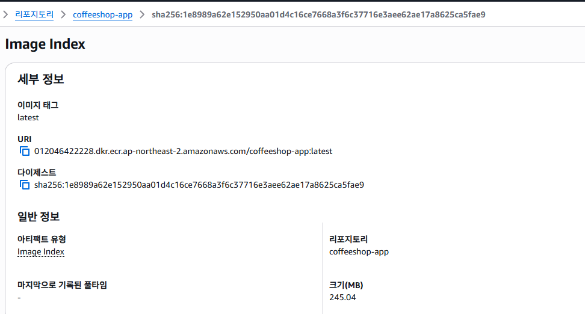
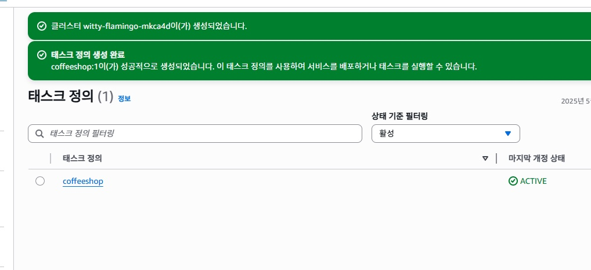
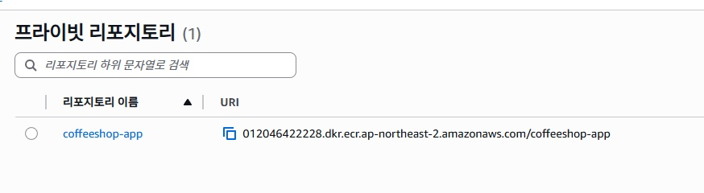

# ☕ CoffeeShop Simulation

A console-based simulation of a coffee shop management system built in Java.  
This project models customer satisfaction, recipe management, weather influence, and research upgrades.
> ✅ This Java project was packaged as a Docker container and deployed using AWS ECS Fargate.  
> See deployment screenshots and Dockerfile below!

## ✨ Features
- Ingredient and Recipe system
- Customer satisfaction tracking
- Weather effects on customer behavior
- Research system to improve shop performance

## ▶ How to Run
1. Compile all `.java` files
2. Run the main class

## 📁 Files
- `CoffeeShop.java`: Main business logic
- `Customer.java`, `Employee.java`: Actor classes
- `Ingredient.java`, `Recipe.java`: Recipe system
- `Weather.java`: Weather simulation
- `ResearchManager.java`: Upgrade logic

## 📷 Preview

### 🟤 Startup Screen
A simple yet intuitive interface that introduces the player as the café manager, with 30 in-game days to operate the shop.

---

### 🟢 Customer Order Processing
Each customer has unique preferences. Weather and overall satisfaction dynamically influence order frequency and behavior.

---

### 🔵 Real-time Feedback & Bonuses
Fast service, preferred menus, and high-quality ingredients generate bonus satisfaction and tips — simulating real customer response.

---

### 🟣 Daily Summary & Financial Report
End-of-day summaries include total sales, satisfaction changes, employee wages, and research points — offering a business-like cycle.

> This project is a miniature tycoon game built inside the Java console.
>
> By modeling customer behavior, dynamic weather effects, satisfaction-driven demand, and research upgrades,  
> it reflects how real-world business logic can be implemented with object-oriented design and clean logic.

---

## ☁️ AWS Deployment (ECS + Fargate)

This project has been containerized with Docker and deployed on AWS using ECS with Fargate launch type.  
It demonstrates how even a Java console application can be turned into a deployable, cloud-hosted service.

### 🔧 Deployment Steps
1. Build the Java application and generate `java-2025ver.jar`
2. Write a `Dockerfile` using the JAR as the entry point
3. Push Docker image to Amazon ECR
4. Define ECS Task and run it via Fargate
5. Monitor logs via CloudWatch

### 📂 Deployment Artifacts
- `java-2025ver.jar`: Java application JAR file
- `Dockerfile`: Docker build instructions for ECS deployment

### 🖼 Screenshots

| ECR Image Pushed | Task Definition | Cluster Run | Registry View |
|------------------|------------------|-------------|----------------|
|  |  |  |  |

### 📘 Learnings
- Experience using AWS IAM, ECS Task Definitions, and Docker tagging
- Hands-on understanding of cloud resource provisioning and deployment lifecycle
- CloudWatch-based troubleshooting for container-based apps

---

## Author
- GitHub: [kul321](https://github.com/kul321)
