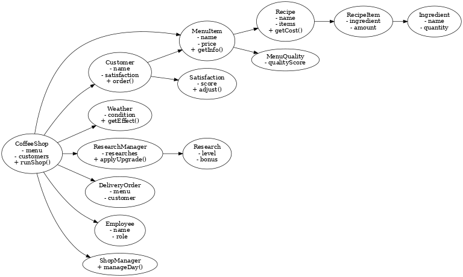
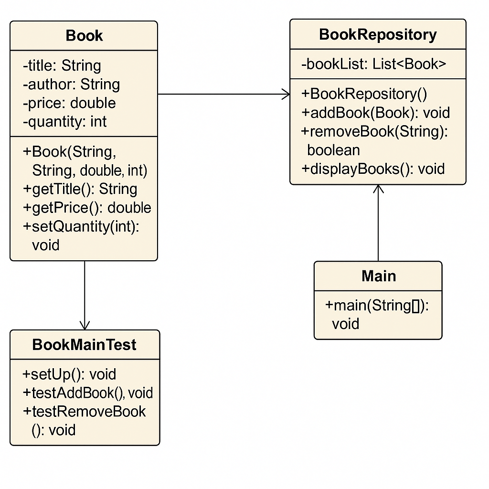
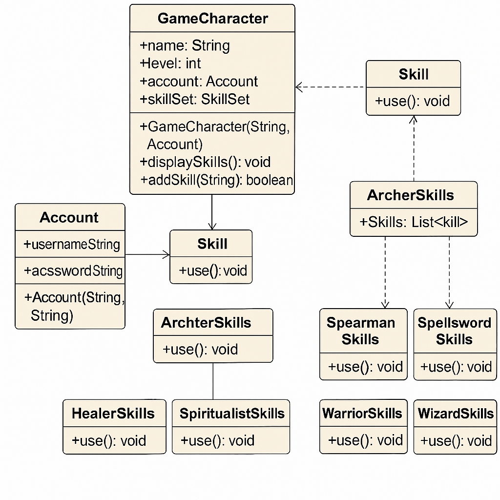
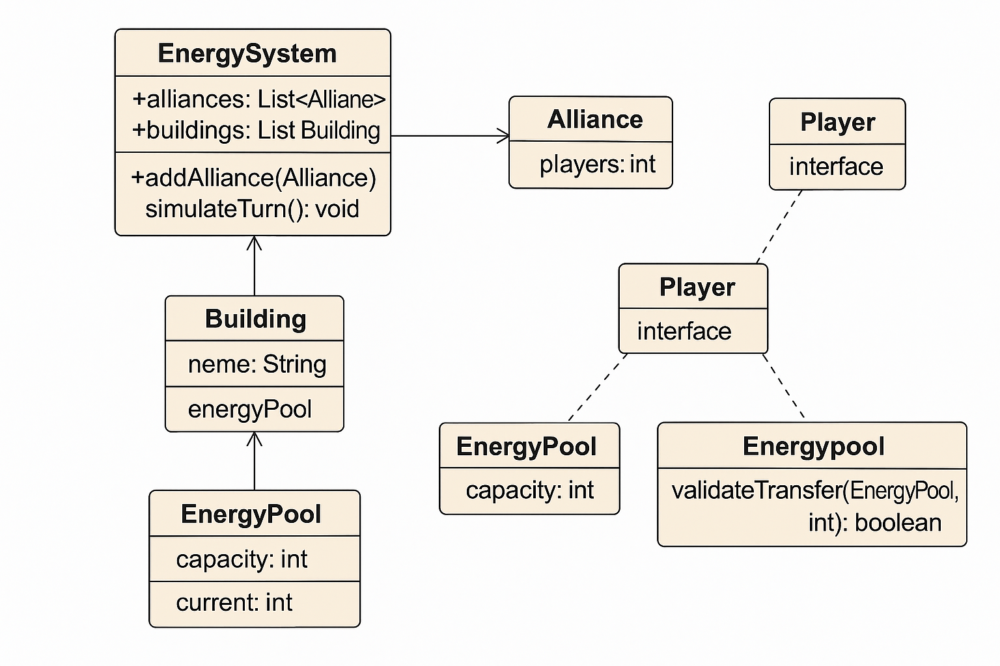
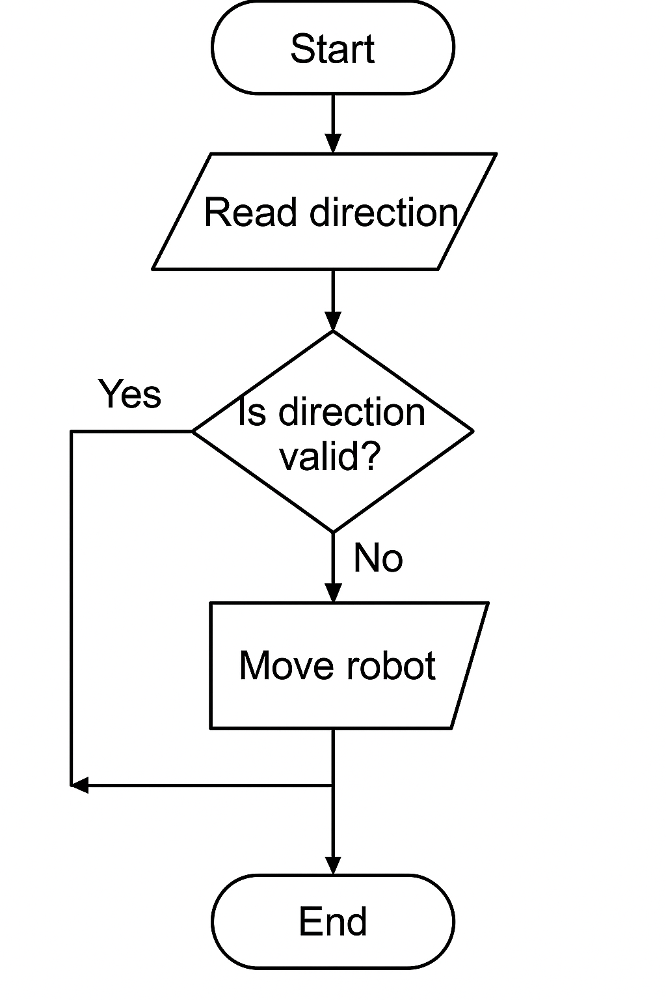
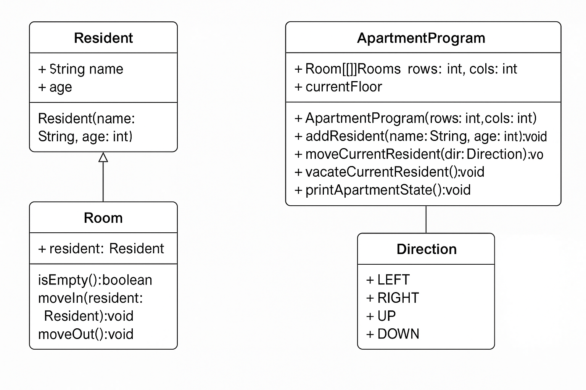

# 💻 Java Simulation Projects – 2025 Portfolio

This repository showcases multiple Java-based console simulation projects, created to demonstrate object-oriented design, logical thinking, and real-world modeling.

## 📁 Included Projects

| Project | Description |
|--------|-------------|
| [CoffeeShop](./CoffeeShop) | ☕ A coffee shop simulation with customer satisfaction, recipes, and weather effects |
| [BookStore](./BookStore) | 📚 A bookstore inventory and sales system with CRUD functionality |
| [CustomizingRPGCharacter](./CustomizingRPGCharacter) | 🧙‍♂️ RPG character and skill customization using modular class design |
| [Energy](./Energy) | ⚡ Turn-based energy transfer and validation simulation between zones and players |
| [RobotPath](./RobotPath) | 🤖 Simple 2D robot movement and direction simulation |
| [Student](./Student) | 🎓 Basic student record management system (add, view, delete) |
| [Apartment](./Apartment) | 🏠 Apartment resident move-in/out and floor transition simulation |
| [WeaponShop](./WeaponShop) | 🗡️ Weapon shop system with customer stat upgrades and turn-based logic |

## 🛠 Tech Stack

- Java (JDK 17)
- Console-based (CLI) interaction
- IntelliJ IDEA
- AWS (ECR, ECS Fargate, IAM roles)
- Docker (Dockerfile, containerization)
- Kubernetes (Minikube, kubectl)

## 💡 Purpose

Each project was designed to:
- Reinforce core object-oriented programming concepts
- Improve algorithmic thinking and program structure
- Practice real-world system modeling through simulation

## 🧩 Class Diagram

---

> 👤 GitHub: [kul321](https://github.com/kul321)
